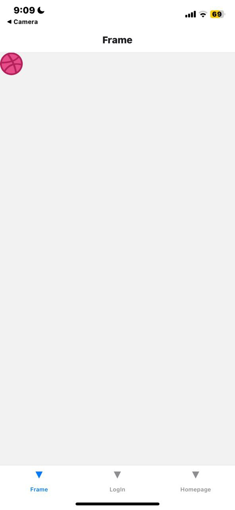
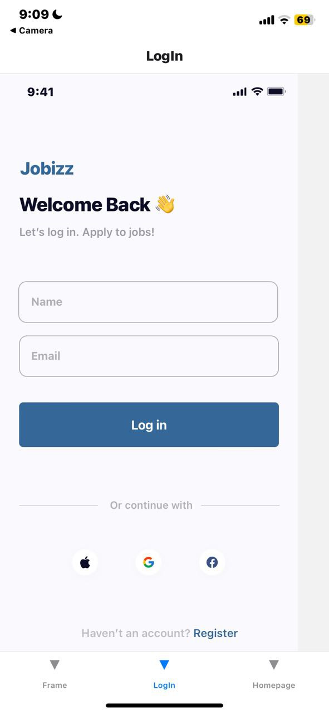

# rn-assignment4-11308636

# React Native Navigation App

This repository contains a simple yet effective React Native application that implements bottom tab navigation. The app includes three essential components: `Frame`, `Homepage`, and `LogIn`. The navigation between these components is managed using the `@react-navigation` library.

## Table of Contents

- [Installation](#installation)
- [Usage](#usage)
- [Components](#components)
  - [Frame](#frame)
  - [Homepage](#homepage)
  - [LogIn](#login)
- [Navigation](#navigation)
- [Screenshots](#screenshots)

## Installation

To set up the project locally, follow these steps:

1. **Clone the repository:**

    
    git clone https://github.com/NorgbePrince/rn-assignment4-11308636.git
    cd rn-assignment4-11308636
    

2. **Install the project dependencies:**

    
    npm install
    

3. **Run the application:**

    
    npm start
    

    Follow the instructions provided to launch the app on your preferred platform (iOS or Android).

## Usage

This application demonstrates a fundamental use of bottom tab navigation with React Navigation. Upon starting, the app presents a tab navigator that includes three screens: `Frame`, `LogIn`, and `Homepage`.

## Components

### Frame

The `Frame` component is located in the `./components/Frame` file. This component is one of the tabs in the bottom navigation.

### Homepage

The `Homepage` component is located in the `./components/Homepage` file. This component serves as the home screen of the application.

### LogIn

The `LogIn` component is located in the `./components/LogIn` file. This component provides a login interface for users.

## Navigation

The navigation setup utilizes the `@react-navigation/native` and `@react-navigation/bottom-tabs` libraries. The `App` component is the main entry point of the application, setting up the navigation container and the bottom tab navigator.

import * as React from "react";
import { NavigationContainer } from "@react-navigation/native";
import { createBottomTabNavigator } from "@react-navigation/bottom-tabs";
import Frame from "./components/Frame";
import Homepage from "./components/Homepage";
import LogIn from "./components/LogIn";

const Tab = createBottomTabNavigator();

const App = () => {
  return (
    <NavigationContainer>
      <Tab.Navigator>
        <Tab.Screen name="Frame" component={Frame} />
        <Tab.Screen name="LogIn" component={LogIn} />
        <Tab.Screen name="Homepage" component={Homepage} />
      </Tab.Navigator>
    </NavigationContainer>
  );
};

export default App;

## Screenshot
- Frame Screen:

  - Homepage Screen:

  - LogIn Screen:

  
  This README is intended to provide clear and detailed guidance on setting up and using the application, ensuring a smooth experience for developers.

